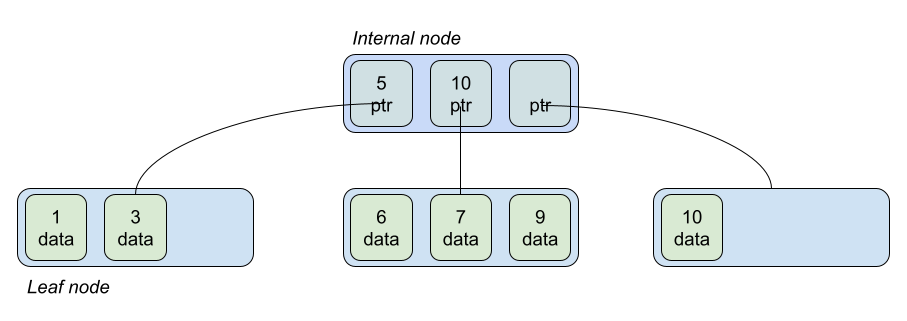
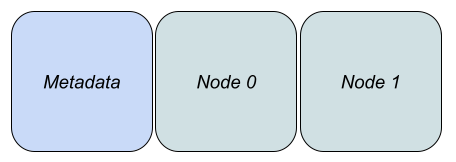

# Socks DB

A small relational database engine written in Rust, primarily for educational benefit.

## Features

- Tabular data abstraction.
- Stores arbitrarily large datasets.
- Structured operations for row insertion, retrieval, basic structured queries.
- Concurrent request processing.
- SIMD-accelerated reads / writes.
- Buffer pool / LRU cache for performant reads.
- Configurable algorithms for benchmarking / experimentation.

## User guide

TODO

## Documentation

### Data layout

Socks DB uses a simplified
[B+ tree](https://en.wikipedia.org/wiki/B%2B_tree) for data storage.

B and B+ trees have been used in database design since the 1970s. TLDR;
tree nodes either store a range of sorted rows, or a set of pointers to child
nodes (which reference the largest value held by their child node, to remain
sorted).

This data structure is popular, because entire B+ tree nodes can be written to
/ read from disk at once, which offers efficiency benefits over comparable
algorithms. Newer algorithms are certainly available, e.g.
[LSM trees](https://en.wikipedia.org/wiki/Log-structured_merge-tree),
perhaps for another day.

Here is an example table:

Keys are represented internally as single `u32`s. The size of each node is
guaranteed to be under some maximum, configurable limit, discussed later under
_file format_. There are 2 distinct node types:

* Leaf nodes.

These store raw row data, sorted by key.

* Internal nodes.

These store pointers (effectively file offsets) to child nodes (either internal
or leaf) that contain no value greater than a known key. All pointers are
sorted by their known key pairs.

Nodes are allowed to grow in size until they reach a configurable size,
at which point nodes are split. There are a number of different algorithms
for B+ tree insertion, retrieval -- Socks DB allows some configuration into
these inner workings, primarily for education / benchmarking / experimentation
purposes. Examples include:

- Aggressive split on insertion.
- Incremental search of node keys on read.
- Binary search of node keys on read.

### File format

Each Socks DB table is tracked in a separate `.socks` file. The file format
itself is fairly straightforward.

- There is a metadata header comprised of high-level information for the
particular table.
- Following that, there are n-many fixed-sized buffers (also called pages,
chunks) that each contain exactly 1 B+ tree node (internal or leaf). The
maximum size of each buffer is configured on the database level.

Using fixed-sized buffers allows optimal maneuvering within the database file
itself, at the cost of wasted disk space (nodes may not always be full) and
a hardcap on row data size (a single row cannot exceed more space than the
leaf node that must contain it), although there are various optimizations /
features that may provide workarounds (e.g. overflow pages).

Socks DB uses [Protobuf](https://protobuf.dev/) as its serialization scheme.
This is simply because proto is built to be serialized to generally compressed
binary, although it comes with the cost of additional overhead to serialize /
deserialize it. The size of any given proto message is not fixed -- the first 2
bytes of each buffer store the size of the wrapped proto.

### Performance

Socks DB supports a couple of features for performant operations:

- SIMD-accelerated node traversal.

Internally, row keys and row column data are stored separately in a
[struct of arrays](https://en.wikipedia.org/wiki/AoS_and_SoA) format, for easy
hand-rolled SIMD-parallelization. This speeds up B+ tree node traversal.

- Multithreading.

Socks DB uses futures / tokio to support concurrent operations. This allows
multiple requests to be processed asynchronously, and speeds up some operations
(e.g. for row insertion, the primary index & all secondary indexes are executed
concurrently).

Internally, B+ tree nodes are cached in a sharded buffer pool for better
concurrent access, behind a RwLock to ensure only one thread can update a given
node at a time.

## Future

### Roadmap

- Row deletion support.
- Multiple table support.
- Benchmarking suite.
- Basic transaction support.
- Persistent access via. sockets.

### Optimizations

- Remove dependency on Protobuf for internal serialization scheme.
- Experiment with better B+ tree balancing algorithms.

## References

- https://dataintensive.net/
- https://www.geeksforgeeks.org/introduction-of-b-tree/
- http://www.cs.columbia.edu/~kar/pubsk/simd.pdf
- http://www.vldb.org/pvldb/vol8/p293-inoue.pdf
